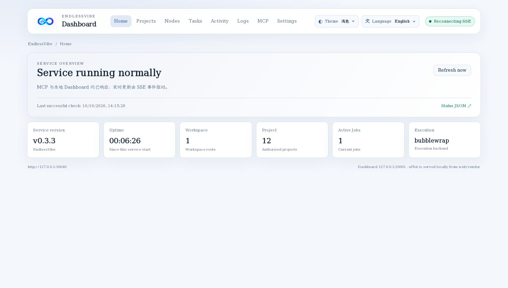
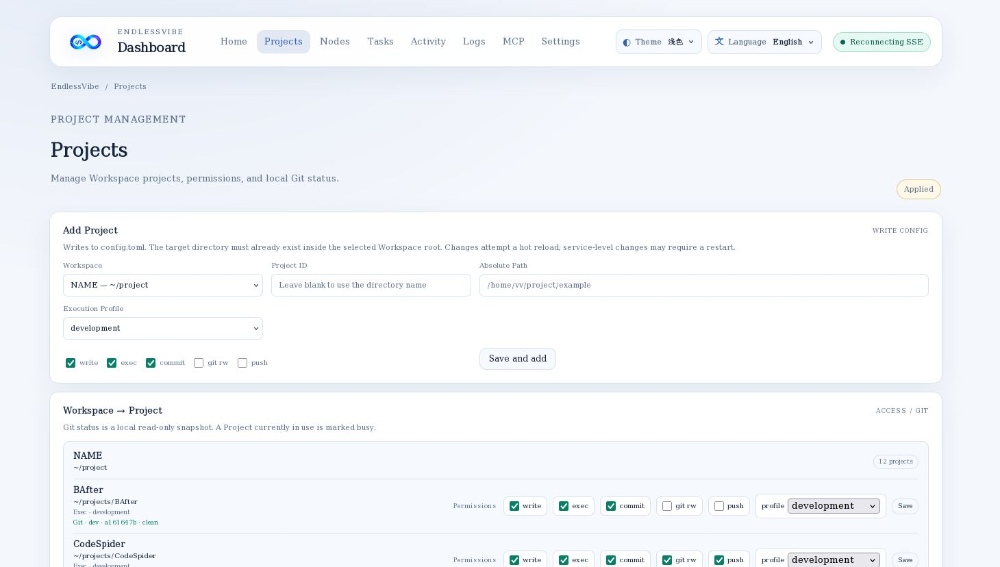
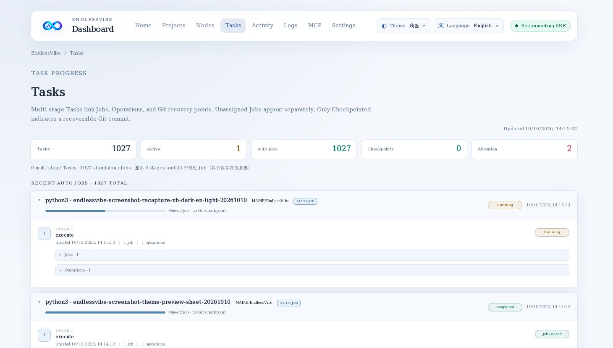
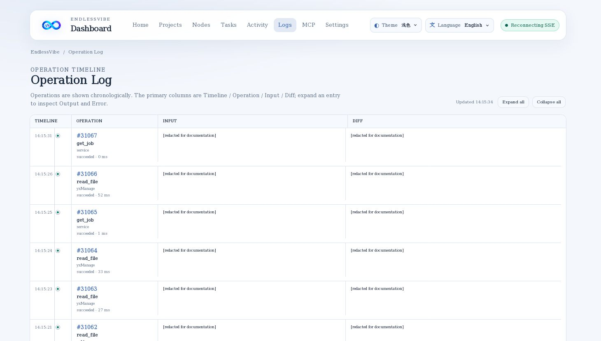
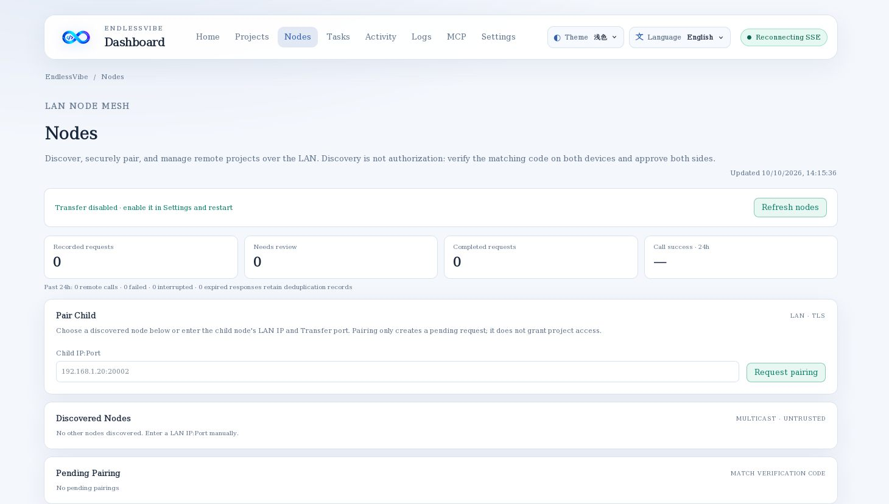
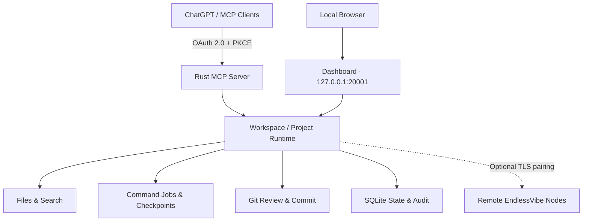

<p align="center">
  
</p>

<p align="center"><a href="README.md">简体中文</a> · <strong>English</strong></p>

<h1 align="center">EndlessVibe</h1>

<p align="center">
  <strong>Connect your local development environment to AI assistants, on your terms.</strong>
  <br>
  A self-hosted Rust MCP server for authorized project access, source editing, command execution, Git workflows, and connected development nodes.
</p>

<p align="center">
  
  
  
  
  <a href="LICENSE"></a>
</p>

<p align="center">
  <a href="#screenshots">Screenshots</a> ·
  <a href="#features">Features</a> ·
  <a href="#quick-start">Quick Start</a> ·
  <a href="#architecture">Architecture</a> ·
  <a href="#security">Security</a> ·
  <a href="#documentation">Documentation</a>
</p>

---

## Overview

**EndlessVibe** connects ChatGPT and other Model Context Protocol (MCP) clients to explicitly authorized local code projects. It includes a browser-based local dashboard for project access, command jobs, audit trails, and node administration.

EndlessVibe is **not** a cloud IDE or a multi-tenant remote shell. It is designed for one owner running their own server, with explicit permissions, per-project coordination, reviewable changes, and recoverable long-running work.

- **MCP Server** — Streamable HTTP transport with OAuth 2.0 authorization.
- **Local Dashboard** — Inspect projects, tasks, activity, operations, configuration, and nodes.
- **Project Runtime** — File APIs, command execution, Git, task checkpoints, and durable jobs.
- **Node Transfer (optional)** — Discover and pair nearby EndlessVibe nodes, then work on explicitly granted remote projects.

## Screenshots

### Dashboard



<sub>Light theme · English interface — service status, execution metrics, and the local management dashboard.</sub>

| Projects | Tasks |
| :---: | :---: |
|  |  |
| Workspace / Project access and configuration | Jobs, stages, and checkpoints |

| Operations | Nodes |
| :---: | :---: |
|  |  |
| Auditable operations and execution history | Node discovery, pairing, and request recovery |

<sub>Screenshots show the latest worktree frontend with live local Dashboard data, in Light / English mode. Personal machine identifiers have been redacted. Node Transfer is disabled by default and requires explicit configuration. The Chinese README shows Dark / 简体中文.</sub>

## Features

| Area | Capabilities |
| --- | --- |
| **Workspaces & Projects** | Two-level authorization model, per-project file/command/Git permissions, independent operation locks |
| **Files & Search** | Secure directory listing, read/write/create, exact patching, code search, SHA-256 conflict detection |
| **Commands & Jobs** | Asynchronous commands, durable job IDs, paged output, cancellation, timeout, request deduplication |
| **Git Workflow** | Reviewable status/diff/log/commit, optional local Git mutation, separately authorized push |
| **Tasks & Recovery** | `task_id + stage` checkpoints, job association, committed recovery points, restart diagnostics |
| **Dashboard** | Runtime charts, Projects, Tasks, Operations, Nodes, configuration, and storage management |
| **Authentication** | OAuth 2.0 Authorization Code, PKCE, dynamic client registration, tool scopes |
| **Node Transfer** | LAN discovery, TLS pairing, scoped grants, persistent remote request status and history |
| **Execution Profiles** | Bubblewrap by default, with explicitly configured Development / Trusted Host profiles |
| **Docker (optional)** | Restrained Docker Engine operations scoped to explicitly allowed containers |

### Workspace and Project Model

A `Workspace` establishes the filesystem management boundary; a `Project` is the unit of permissions and operations:

```text
Workspace: projects                  /home/user/projects
├── Project: website                 website/
├── Project: kernel                  kernel/
└── Project: tools                   tools/
```

Different Projects can run independent operations concurrently. File changes, commands, and Git mutations on the **same** Project share an operation lock to reduce conflicting changes.

## Quick Start

### Requirements

- Linux 5.6+ for secure path handling
- Rust / Cargo **1.88+**
- Git and a C/C++ compiler toolchain
- Bubblewrap and unprivileged user namespaces for the default execution backend

EndlessVibe **refuses to run as root**. It is primarily intended for self-hosted Linux environments.

### 1. Build

From the repository root:

```bash
cargo build --release
cargo test --locked
```

Optionally check whether the configured Bubblewrap sandbox can see the required toolchains:

```bash
./target/release/endlessvibe --check-sandbox
```

### 2. Initialize a Workspace

Create an existing directory as the Workspace root and initialize the service:

```bash
mkdir -p "$HOME/projects"

./target/release/endlessvibe \
  --init \
  --workspace "projects=$HOME/projects" \
  --public-url https://mcp.example.com
```

`--init` creates the configuration and private state, including a random owner key. A Workspace does **not** automatically grant file, command, or Git access to its children.

### 3. Register a Project

```bash
# The target directory must already exist.
./target/release/endlessvibe \
  --add-project "projects:website=$HOME/projects/website"
```

Projects must be located inside an authorized Workspace root. Use `--read-only` or `--no-exec` to reduce the permissions of a newly registered Project.

### 4. Start the Server

```bash
./target/release/endlessvibe
```

| Service | Default endpoint |
| --- | --- |
| **Dashboard** | [http://127.0.0.1:20001](http://127.0.0.1:20001) (loopback only) |
| **MCP** | `/mcp` on port `20000` by default; use HTTPS for public access |
| **Node Transfer** | Disabled by default; requires configuration and approval on both nodes |

Use `--status`, `--stop`, and `--restart` for process management.

### 5. Connect an MCP Client

In ChatGPT or another MCP-compatible client:

```text
Name:           EndlessVibe
Server URL:     https://mcp.example.com/mcp
Authentication: OAuth 2.0
```

Replace the example origin with your configured `server.public_url`. Your reverse proxy or tunnel must also route the OAuth endpoints, not just `/mcp`. **Never place an `owner.key` or access token in URLs.**

See [OAuth](docs/OAUTH.md) and [Cloudflare Tunnel](docs/DOCKER_TUNNEL.md).

## Usage

### Read and edit a file

```text
list_workspaces
  → list_projects(workspace)
  → read_file(workspace, project, path)
  → apply_patch(workspace, project, path, expected_sha256, edits)
```

Existing files require the returned `expected_sha256` for conflict-safe edits. Use the literal `MISSING` when creating a new file. Patches use exact text replacements rather than unified diff input.

### Run a command job

```json
{
  "workspace": "projects",
  "project": "website",
  "program": "cargo",
  "args": ["test", "--locked"],
  "request_id": "website-test-001",
  "timeout_seconds": 120
}
```

A command returns a Job ID. Query it through `get_job` / `get_job_output`. After connection loss, inspect the original request before taking further action; **do not blindly retry a mutation under a different request ID**.

### Review and commit changes

```text
git_status
  → git_diff(paths)
  → Review changes
  → git_commit(paths, expected_head, expected_diff_sha256)
```

`git_commit` includes only reviewed paths and does not push by default. Remote pushes require an additional per-Project permission.

## Architecture



- **Backend:** Rust with Axum, Tokio, rmcp, Rusqlite, and Rustls.
- **Frontend:** Local static assets bundled with the Rust binary; no separate frontend server.
- **Storage:** SQLite persists authorization, job/task metadata, operation logs, and node records.
- **Isolation:** Project-scoped locks and authorization, secure paths, and configurable command execution backends.

## Configuration

Configuration defaults to `~/.config/endlessvibe/config.toml` and state to `~/.local/state/endlessvibe`, respecting the corresponding XDG environment variables.

Example Workspace / Project configuration:

```toml
[[workspaces]]
id = "projects"
path = "/home/user/projects"

[[workspaces.projects]]
id = "website"
path = "website"
allow_write = true
allow_exec = true
allow_git_commit = true
allow_git_mutation = false
allow_git_push = false
execution_profile = "isolated"
```

Execution profiles:

| Profile | Purpose |
| --- | --- |
| `isolated` | Default restricted environment using Bubblewrap |
| `development` | For trusted development projects; host networking may be enabled by configuration |
| `trusted_host` | **High-risk opt-in:** with an acknowledged Host backend, run locally installed executables on PATH |

`trusted_host` is **not enabled by default**. Switching the **global** execution backend to Host removes Bubblewrap isolation for other command-enabled Projects too. Use it only in environments you control.

See [Example Configuration](config/config.example.toml) and [Execution](docs/EXECUTION.md).

## Security

EndlessVibe is designed for **single-owner, self-hosted** workflows, not for exposing your host to untrusted users.

- **Explicit access control:** Private MCP tools require OAuth and appropriate scopes; Project permissions are configured separately.
- **Path safety:** File APIs reject traversal outside a Project root and symlink-based boundary bypasses.
- **Sandbox by default:** Bubblewrap does not mount your full HOME, SSH credentials, Docker socket, or the service state directory by default.
- **Privileged actions are opt-in:** Shell, Docker changes, Git pushes, and Host execution have separate configuration requirements.
- **Recovery and auditability:** Persisted jobs, operation records, and checkpoints support diagnosis. Uncertain execution outcomes are never assumed not to have happened.
- **Loopback-only Dashboard:** Do not expose the management UI through a public reverse proxy.

Review [Security](docs/SECURITY.md) and [Execution](docs/EXECUTION.md) before enabling public MCP access or switching execution backends.

## Development

```bash
cargo fmt --check
cargo test --locked
cargo build --release
```

Keep changes focused, review diffs, and run relevant tests before proposing a commit. Issues and pull requests are welcome under the MIT License.

## Documentation

| Document | What it covers |
| --- | --- |
| [MCP Tools](docs/TOOLS.md) | Exposed tools, arguments, and behavior |
| [Execution](docs/EXECUTION.md) | Bubblewrap, Host, toolchains, jobs, preflight |
| [Security](docs/SECURITY.md) | Authorization, trust boundaries, deployment |
| [OAuth](docs/OAUTH.md) | OAuth 2.0, PKCE, client integration |
| [Git Recovery](docs/GIT_RECOVERY.md) | Review tokens, Git commit, recovery |
| [Node Transfer](docs/TRANSFER.md) | Discovery, pairing, idempotency, diagnostics |
| [Cloudflare Tunnel](docs/DOCKER_TUNNEL.md) | HTTPS/tunnel deployment |

## License

EndlessVibe is released under the [MIT License](LICENSE).
