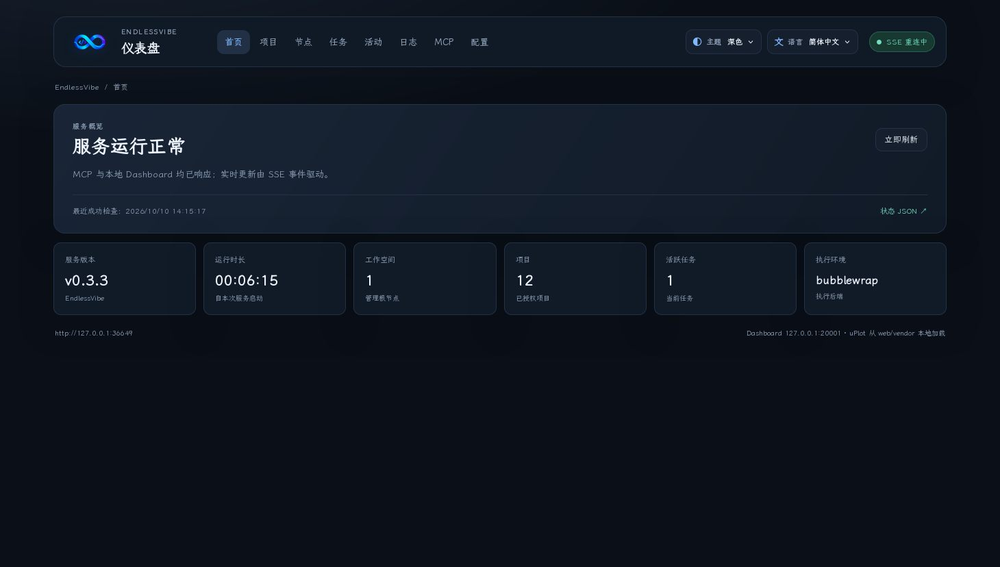
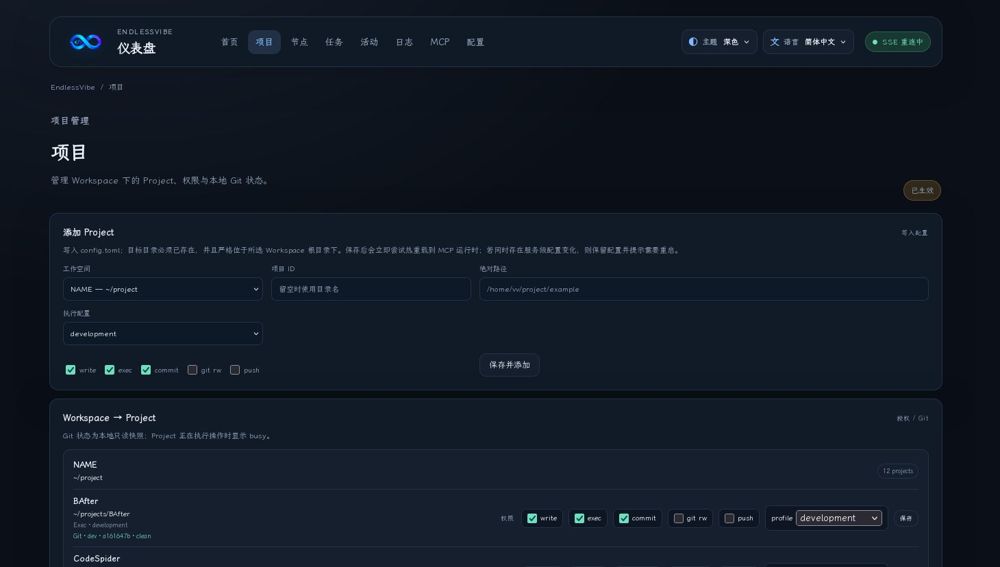
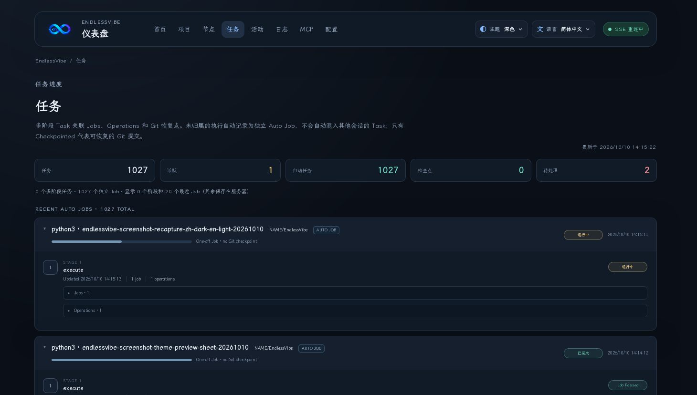
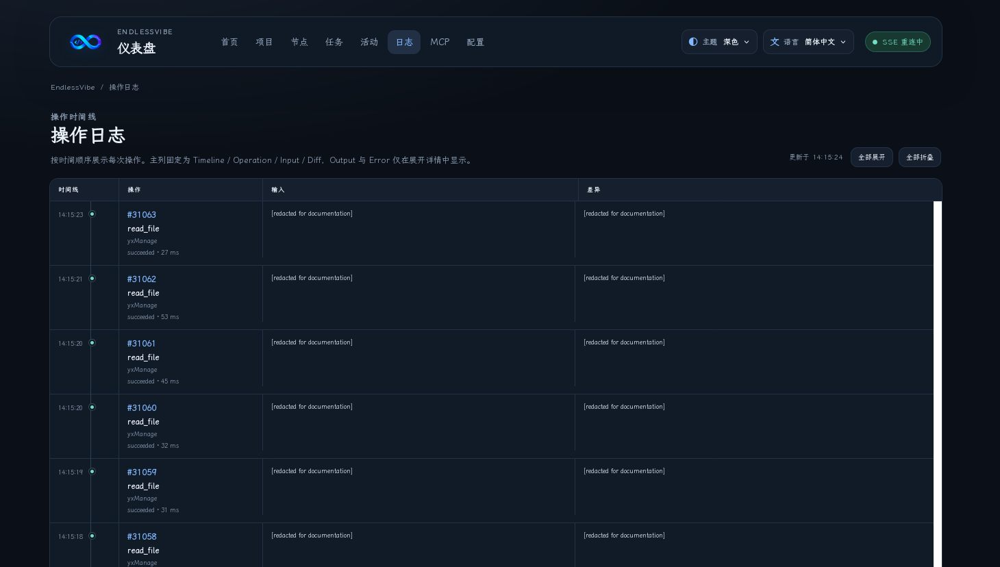
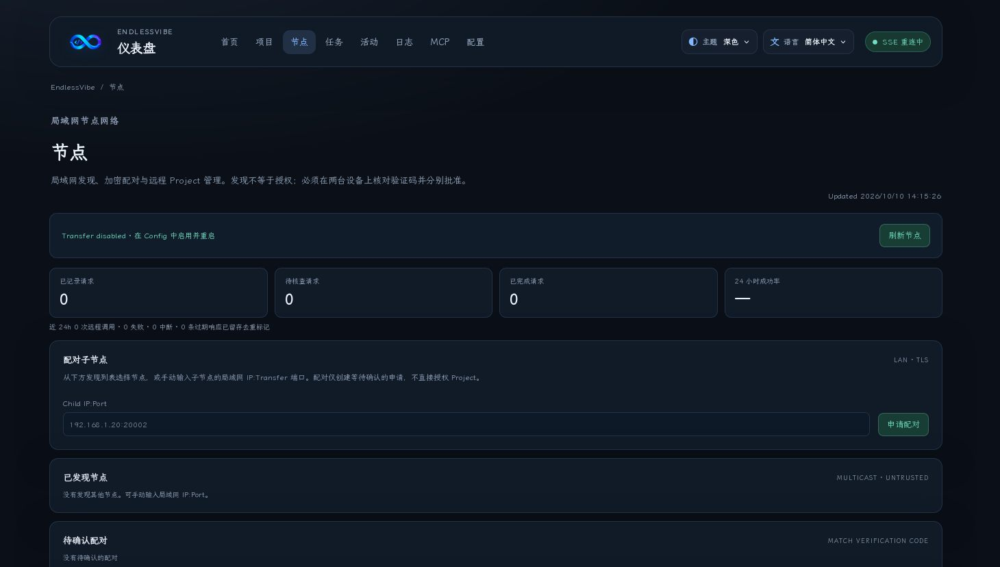
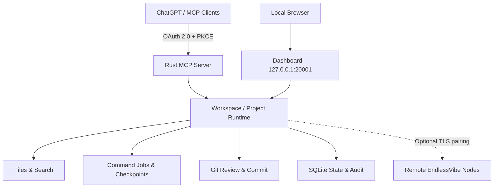

<p align="center">
  
</p>

<p align="center"><strong>简体中文</strong> · <a href="README.en.md">English</a></p>

<h1 align="center">EndlessVibe</h1>

<p align="center">
  <strong>把本地开发环境安全地连接到 AI 助手。</strong>
  <br>
  一个使用 Rust 构建的自托管 MCP 开发服务，统一管理项目、代码、命令、Git 与远程节点。
</p>

<p align="center">
  
  
  
  
  <a href="LICENSE"></a>
</p>

<p align="center">
  <a href="#screenshots">界面预览</a> ·
  <a href="#features">核心功能</a> ·
  <a href="#quick-start">快速开始</a> ·
  <a href="#architecture">架构</a> ·
  <a href="#security">安全</a> ·
  <a href="#documentation">文档</a>
</p>

---

## Overview

**EndlessVibe** 让 ChatGPT 等支持 MCP（Model Context Protocol）的客户端通过统一接口操作**已授权**的本地代码项目，并提供可在浏览器中查看的 Dashboard。

它不是云端 IDE，也不是多用户远程 Shell。服务由使用者自行托管，核心设计是**显式授权、按 Project 隔离、操作可审查、长任务可恢复**。

- **MCP Server**：通过 Streamable HTTP 和 OAuth 2.0 授权客户端。
- **Local Dashboard**：查看项目、任务、代码操作、执行记录与节点状态。
- **Project Runtime**：提供文件、命令、Git、Checkpoint 及持久化 Job 管理。
- **Node Transfer（可选）**：在局域网中配对其他 EndlessVibe 节点，远程访问获授权的 Project。

## Screenshots

### Dashboard



<sub>深色主题 · 简体中文 — 服务状态、执行指标与本地控制台。</sub>

| Projects | Tasks |
| :---: | :---: |
|  |  |
| Workspace / Project 权限与配置 | Job 状态、阶段与 Checkpoint |

| Operations | Nodes |
| :---: | :---: |
|  |  |
| 操作审计与执行记录 | 节点发现、配对与远程请求诊断 |

<sub>截图使用当前工作区新版前端与本地运行服务的数据生成，已脱敏部分本机标识。英文版 README 展示亮色英文界面；Nodes / Transfer 功能默认关闭，需要主动配置。</sub>

## Features

| 模块 | 能力 |
| --- | --- |
| **Workspace & Project** | 两层工作空间模型，项目级读写、执行和 Git 权限，独立操作锁 |
| **Files & Search** | 安全列目录、读取、创建、写入、精确 Patch、代码搜索；SHA-256 冲突检查 |
| **Commands & Jobs** | 异步命令、持久 Job ID、输出分页、超时、取消、请求去重 |
| **Git Workflow** | Status、Diff 审查、Log、Commit；按需启用本地 Git 修改或受限 Push |
| **Tasks & Recovery** | `task_id + stage` Checkpoint、Job 关联、提交恢复点、重启诊断 |
| **Dashboard** | 状态图表、Projects、Tasks、Operations、Nodes、配置与存储管理 |
| **Authentication** | OAuth 2.0 Authorization Code、PKCE、动态客户端注册及工具 Scope |
| **Node Transfer** | 局域网发现、TLS 配对、Project 授权、远程请求状态与历史 |
| **Execution Profiles** | 默认 Bubblewrap 沙箱；可显式切换 Development / Trusted Host |
| **Docker（可选）** | 通过受限 Engine API 查看、管理获授权的容器 |

### Workspace 与 Project

`Workspace` 只是根目录管理边界，`Project` 才是可执行操作的授权单元：

```text
Workspace: projects                  /home/user/projects
├── Project: website                 website/
├── Project: kernel                  kernel/
└── Project: tools                   tools/
```

不同 Project 可以并行工作；同一个 Project 的文件、命令和 Git 修改共享操作锁，避免互相覆盖。

## Quick Start

### Requirements

- Linux 5.6+（包含安全文件路径操作所需的内核支持）
- Rust / Cargo **1.88+**
- Git、C/C++ 编译工具链
- Bubblewrap 与可用的非特权 User Namespace（默认执行后端）

EndlessVibe **拒绝以 root 身份启动**。目前主要面向 Linux 本机部署。

### 1. Build

在项目源码目录中：

```bash
cargo build --release
cargo test --locked
```

可选：检查 Bubblewrap 环境是否具备所需工具链。

```bash
./target/release/endlessvibe --check-sandbox
```

### 2. Initialize

准备一个已存在的 Workspace 根目录，再初始化配置：

```bash
mkdir -p "$HOME/projects"

./target/release/endlessvibe \
  --init \
  --workspace "projects=$HOME/projects" \
  --public-url https://mcp.example.com
```

`--init` 会创建配置和私有状态（包含 Owner Key）；不会自动向客户端授予项目权限。

### 3. Add a Project

```bash
# 请先确保目标目录已经存在
./target/release/endlessvibe \
  --add-project "projects:website=$HOME/projects/website"
```

Project 必须位于已登记的 Workspace 根目录之内。首次添加时也可选择 `--read-only` 或 `--no-exec` 收紧权限。

### 4. Start

```bash
./target/release/endlessvibe
```

| 入口 | 默认地址 / 说明 |
| --- | --- |
| **Dashboard** | [http://127.0.0.1:20001](http://127.0.0.1:20001)（仅本地） |
| **MCP** | `/mcp`，默认在 `20000` 端口监听；公网部署须配合 HTTPS |
| **Nodes / Transfer** | 默认关闭；需要独立配置及双方确认配对 |

可通过 `--status`、`--stop`、`--restart` 管理服务进程。

### 5. Connect an MCP Client

在 ChatGPT 或其他支持 MCP 的客户端中配置：

```text
Name:           EndlessVibe
Server URL:     https://mcp.example.com/mcp
Authentication: OAuth 2.0
```

把示例域名替换为实际的 `server.public_url`。反向代理 / Tunnel 除 `/mcp` 外，还必须放行 OAuth 相关端点。**不要将 `owner.key`、令牌或登录凭据放进 URL。**

详见 [OAuth 接入](docs/OAUTH.md) 与 [Cloudflare Tunnel](docs/DOCKER_TUNNEL.md)。

## Usage

### Read and edit files

```text
list_workspaces
  → list_projects(workspace)
  → read_file(workspace, project, path)
  → apply_patch(workspace, project, path, expected_sha256, edits)
```

已有文件必须提供读取时返回的 `expected_sha256`；创建文件使用 `MISSING`。Patch 使用精确文本替换，防止覆盖并发修改。

### Run a job

```json
{
  "workspace": "projects",
  "project": "website",
  "program": "cargo",
  "args": ["test", "--locked"],
  "request_id": "website-test-001",
  "timeout_seconds": 120
}
```

命令会返回 Job ID。之后通过 `get_job` / `get_job_output` 查询结果；网络中断时先查询原请求状态，**不要换一个请求 ID 盲目重放**。

### Review and commit changes

```text
git_status
  → git_diff(paths)
  → Review changes
  → git_commit(paths, expected_head, expected_diff_sha256)
```

`git_commit` 只提交通过审查的路径，不会默认执行 Push；远端推送需要额外启用 Project 权限。

## Architecture



- **Rust**：Axum、Tokio、rmcp、Rusqlite、Rustls。
- **Web UI**：随 Rust 服务一起分发的静态资源；无需额外部署前端服务。
- **State**：SQLite 存储认证、任务、操作和节点状态；敏感内容按不同接口进行脱敏或限制保留。
- **Isolation**：项目锁、文件系统边界以及可配置的命令执行后端。

## Configuration

配置文件默认位于 `~/.config/endlessvibe/config.toml`，状态目录默认位于 `~/.local/state/endlessvibe`（遵循对应的 XDG 环境变量）。

配置中的 Workspace / Project 示例：

```toml
[[workspaces]]
id = "projects"
path = "/home/user/projects"

[[workspaces.projects]]
id = "website"
path = "website"
allow_write = true
allow_exec = true
allow_git_commit = true
allow_git_mutation = false
allow_git_push = false
execution_profile = "isolated"
```

可用的 Project 执行模式：

| Profile | 用途 |
| --- | --- |
| `isolated` | 默认受限开发环境，使用 Bubblewrap 的隔离能力 |
| `development` | 可信开发项目，可按配置共享主机网络，但仍受执行后端约束 |
| `trusted_host` | 显式高风险选项：配合已确认的 Host 后端，允许运行 PATH 中已安装的本机工具 |

`trusted_host` **不是默认功能**。它要求全局启用无沙箱的 Host 执行，会影响其他可执行项目的隔离安全性；仅应在受控环境中使用。

完整配置示例见 [config/config.example.toml](config/config.example.toml)，执行模式与工具链说明见 [docs/EXECUTION.md](docs/EXECUTION.md)。

## Security

EndlessVibe 是**单用户、自托管**开发工具，不应作为允许不可信用户共享宿主权限的多租户服务。

- **授权优先**：私有 MCP 工具需要 OAuth 认证及对应 Scope；Project 权限显式配置。
- **路径保护**：文件 API 不允许逃逸 Project 根目录或通过符号链接绕过边界。
- **默认执行隔离**：Bubblewrap 不默认暴露真实 HOME、SSH 凭据、Docker Socket 或服务状态目录。
- **危险操作需显式开启**：Shell、Docker 修改、Git Push 和 Host 执行均有独立条件或配置约束。
- **可追溯**：Job、操作日志和恢复状态持久化；未知执行结果不能推断为“未执行”。
- **Dashboard 仅监听本机**：不要通过公网反向代理暴露管理界面。

请阅读 [安全模型](docs/SECURITY.md) 和 [执行模型](docs/EXECUTION.md)，再开放外部 MCP 客户端或切换执行后端。

## Development

```bash
cargo fmt --check
cargo test --locked
cargo build --release
```

提交代码时建议按功能拆分 Commit，在每次修改后检查 `git diff` 和相应测试。项目遵循 MIT License，欢迎通过 Issue / Pull Request 讨论问题与改进。

## Documentation

| 文档 | 内容 |
| --- | --- |
| [Tools](docs/TOOLS.md) | MCP 工具及参数 |
| [Execution](docs/EXECUTION.md) | Bubblewrap、Host、Toolchain、Job 与预检 |
| [Security](docs/SECURITY.md) | 权限、安全边界与部署注意事项 |
| [OAuth](docs/OAUTH.md) | OAuth 2.0、PKCE 与客户端接入 |
| [Git Recovery](docs/GIT_RECOVERY.md) | Git 审查、提交与恢复 |
| [Node Transfer](docs/TRANSFER.md) | 节点发现、授权、请求去重与诊断 |
| [Cloudflare Tunnel](docs/DOCKER_TUNNEL.md) | HTTPS / Tunnel 部署 |

## License

EndlessVibe 基于 [MIT License](LICENSE) 开源。
