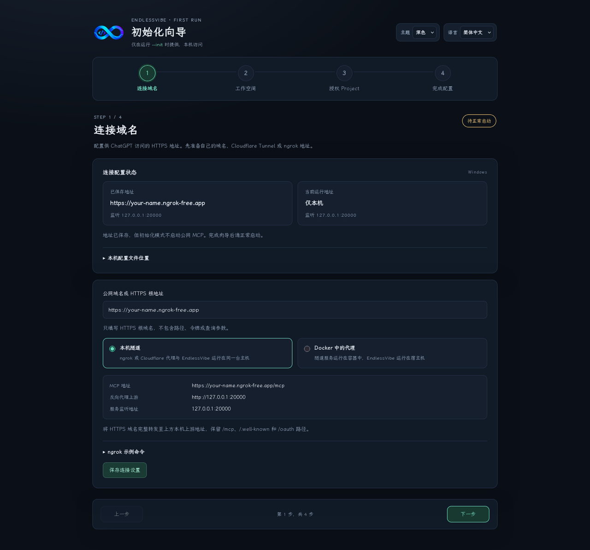
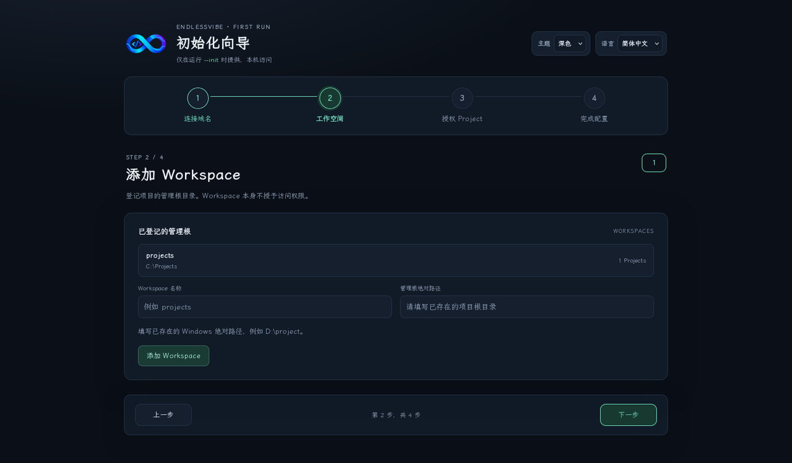
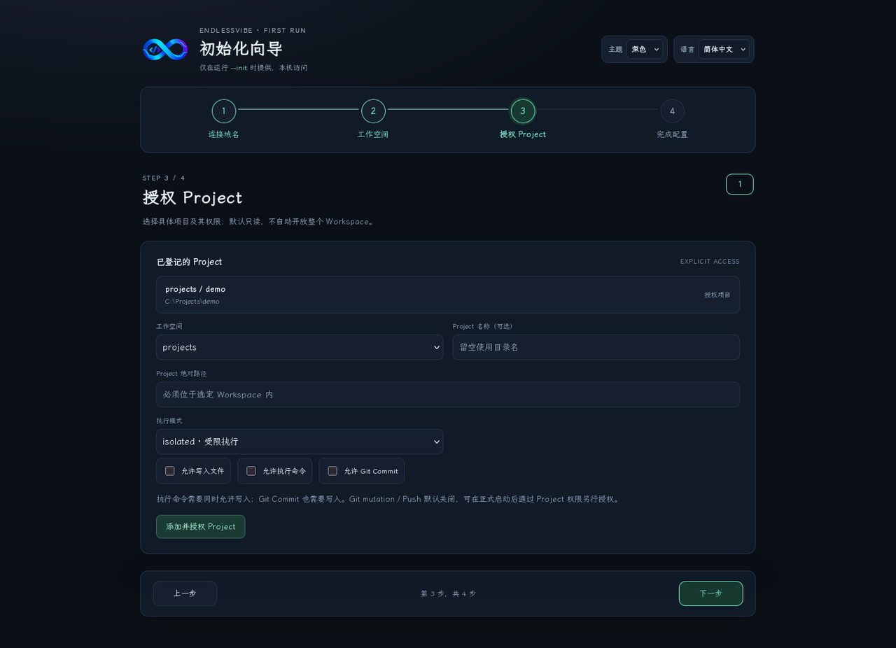
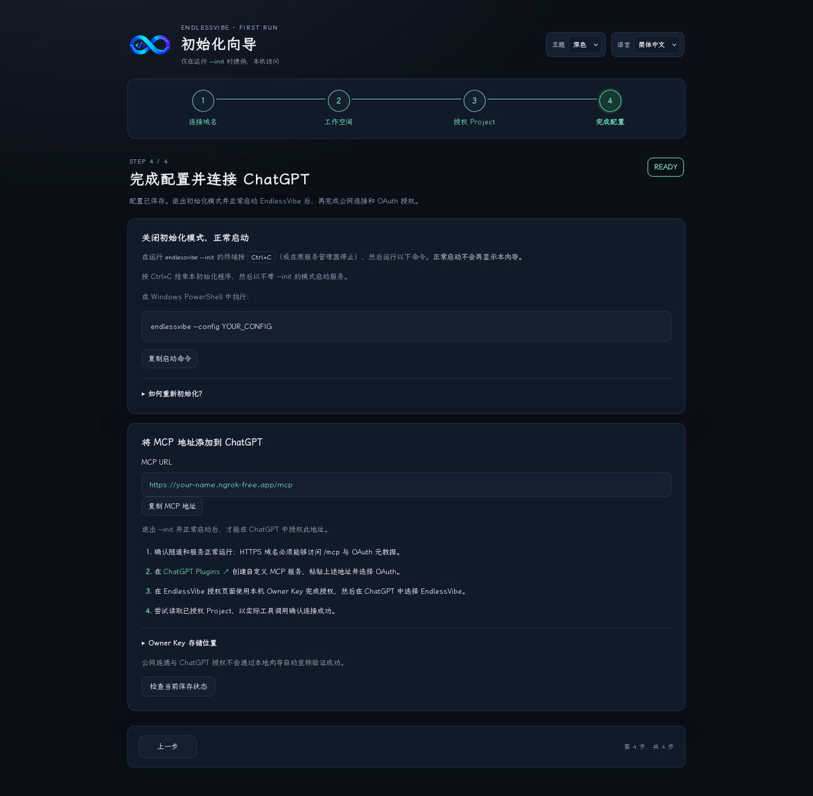
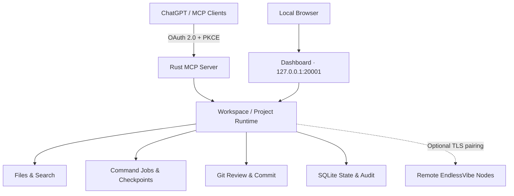

<p align="center">
  
</p>

<p align="center"><strong>简体中文</strong> · <a href="README.en.md">English</a></p>

<h1 align="center">EndlessVibe</h1>

<p align="center">
  <strong>把本地开发环境安全地连接到 AI 助手。</strong>
  <br>
  一个使用 Rust 构建的自托管 MCP 开发服务，统一管理项目、代码、命令、Git 与远程节点。
</p>

<p align="center">
  
  
  
  
  <a href="LICENSE"></a>
</p>

<p align="center">
  <a href="#screenshots">界面预览</a> ·
  <a href="#features">核心功能</a> ·
  <a href="#quick-start">快速开始</a> ·
  <a href="#architecture">架构</a> ·
  <a href="#security">安全</a> ·
  <a href="#documentation">文档</a>
</p>

---

## Overview

**EndlessVibe** 让 ChatGPT 等支持 MCP（Model Context Protocol）的客户端通过统一接口操作**已授权**的本地代码项目，并提供可在浏览器中查看的 Dashboard。

它不是云端 IDE，也不是多用户远程 Shell。服务由使用者自行托管，核心设计是**显式授权、按 Project 隔离、操作可审查、长任务可恢复**。

- **MCP Server**：通过 Streamable HTTP 和 OAuth 2.0 授权客户端。
- **Local Dashboard**：查看项目、任务、代码操作、执行记录与节点状态。
- **Project Runtime**：提供文件、命令、Git、Checkpoint 及持久化 Job 管理。
- **Node Transfer（可选）**：在局域网中配对其他 EndlessVibe 节点，远程访问获授权的 Project。

## Screenshots

### Setup · 初始化向导

执行 `endlessvibe --init --web` 后，网页按照以下四个步骤逐步完成配置。顶部显示进度，下面仅展示当前步骤的表单。

| 第 1 步 · 连接域名 | 第 2 步 · 添加 Workspace |
| :---: | :---: |
|  |  |
| 第 3 步 · 授权 Project | 第 4 步 · 完成配置 |
|  |  |

<sub>深色主题 · 简体中文。四张截图均通过实际 Setup 网页和隔离的演示数据渲染；不包含真实 Owner Key、令牌或项目路径，也不代表公网连接已验证。</sub>

### Dashboard


<sub>深色主题 · 简体中文 — 服务状态、执行指标与本地控制台。</sub>

| Projects | Tasks |
| :---: | :---: |
|  |  |
| Workspace / Project 权限与配置 | Job 状态、阶段与 Checkpoint |

| Operations | Nodes |
| :---: | :---: |
|  |  |
| 操作审计与执行记录 | 节点发现、配对与远程请求诊断 |

<sub>Dashboard / Projects / Tasks / Operations / Nodes 截图使用本地运行服务的数据生成，已脱敏本机标识。Setup 截图使用同一套实际网页资源与隔离的演示配置生成；英文版 README 展示对应的浅色界面。Nodes / Transfer 默认关闭，需要主动配置。</sub>

## Features

| 模块 | 能力 |
| --- | --- |
| **Workspace & Project** | 两层工作空间模型，项目级读写、执行和 Git 权限，独立操作锁 |
| **Files & Search** | 安全列目录、读取、创建、写入、精确 Patch、代码搜索；SHA-256 冲突检查 |
| **Commands & Jobs** | 异步命令、持久 Job ID、输出分页、超时、取消、请求去重 |
| **Git Workflow** | Status、Diff 审查、Log、Commit；按需启用本地 Git 修改或受限 Push |
| **Tasks & Recovery** | `task_id + stage` Checkpoint、Job 关联、提交恢复点、重启诊断 |
| **初始化 / Dashboard** | 独立的本机初始化向导（按构建版本支持 Web 或 CLI/Web 双模式）；正常 Dashboard 提供状态图表、Projects、Tasks、Operations、Nodes 及配置管理 |
| **Authentication** | OAuth 2.0 Authorization Code、PKCE、动态客户端注册及工具 Scope |
| **Node Transfer** | 局域网发现、TLS 配对、Project 授权、远程请求状态与历史 |
| **Execution Profiles** | Linux Bubblewrap、Windows AppContainer 离线沙箱；显式项目授权 |
| **Docker（可选）** | 通过受限 Engine API 查看、管理获授权的容器 |

### Workspace 与 Project

`Workspace` 只是根目录管理边界，`Project` 才是可执行操作的授权单元：

```text
Workspace: projects                  /home/user/projects
├── Project: website                 website/
├── Project: kernel                  kernel/
└── Project: tools                   tools/
```

不同 Project 可以并行工作；同一个 Project 的文件、命令和 Git 修改共享操作锁，避免互相覆盖。

## Quick Start

### Requirements

- **Linux 5.6+、macOS、Windows 10/11**（macOS / Windows 为新增适配平台，需要在对应系统验证后正式发布）
- Rust / Cargo **1.88+**
- Git、C/C++ 编译工具链（需安装于目标操作系统）
- Linux 默认需要 Bubblewrap 与可用的非特权 User Namespace；Windows 可选择原生 `appcontainer` 离线沙箱。macOS / Windows 新配置仍默认禁用命令执行，`host` 需显式风险确认

Linux 下仍拒绝以 root 身份启动。跨平台文件操作采用目录句柄边界检查；**Bubblewrap 只在 Linux 可用，Windows 没有 Docker Unix Socket 接口，不能将两者视为跨平台已实现的功能**。详见 [跨平台支持与安全限制](docs/PORTABILITY.md)。

### 1. Build

在项目源码目录中：

```bash
cargo build --release
cargo test --locked
```

**发布包（Windows 单 EXE / Linux AppImage）：**

```powershell
# Windows 10/11 x64，要求 Rust MSVC 与 C++ Build Tools
.\deploy\windows\Package.ps1
# 输出：dist\windows\endlessvibe.exe（只有这一个 EXE）
```

```bash
# Linux x86_64 / aarch64，需事先安装官方 appimagetool
./deploy/linux/package-appimage.sh --appimagetool /path/to/appimagetool-x86_64.AppImage
# 输出：dist/linux/EndlessVibe-VERSION-x86_64.AppImage
```

Windows 脚本使用静态 MSVC CRT，并审核可执行文件的系统 DLL 导入；Linux 脚本构建 AppDir，调用 appimagetool 并检查 AppImage 能否运行 `--version`。两种格式的 Web 资源都内嵌在可执行文件中，**不打包 config.toml、Owner Key 或私有状态**。完整步骤、离线构建和发行限制见 [打包与分发](docs/PACKAGING.md)。

### 2. 进入初始化向导

解压发行包后可直接运行程序，不需要在使用者电脑上安装 Rust。首次初始化以及需要重新配置时，在终端执行：

```powershell
# 适用于复制到其他 Windows 电脑的独立 EXE
.\endlessvibe.exe --init

# 如果从 Windows 项目源码构建
.\target\release\endlessvibe.exe --init
```

Linux/macOS 源码构建的对应命令为 `./target/release/endlessvibe --init`。

**初始化入口与构建版本有关。** 请先用 `.\endlessvibe.exe --help` 查看支持的参数：如果帮助包含 `--cli` 和 `--web`，程序在交互式终端执行 `--init` 时会提示选择模式：

```text
EndlessVibe · 初始化
1) 命令行交互（推荐）
2) Web 网页向导（仅本机）
? 初始化方式 [1/2] (默认 1):
```

支持双模式的版本也可以跳过菜单直接指定：

```powershell
.\endlessvibe.exe --init --cli   # 在当前终端交互完成配置
.\endlessvibe.exe --init --web   # 仅启动本机网页初始化向导
```

如果 `--help` **未列出** `--cli` / `--web`，该构建只支持 `--init` 启动 Web 向导，不能直接传入上述两个参数。非交互终端中的双模式版本也可能直接选择 Web 模式。旧式 `--init --workspace ID=绝对路径` 是**参数式创建配置并退出**，不是交互式 CLI 向导。

初始化使用本机配置文件，不会默认公开任何 Project。已存在配置时，重新初始化不会清空 Owner Key、Workspace / Project 授权或其他持久状态。

### 3. 完成 CLI 或 Web 初始化配置

两种初始化方式都围绕相同的四个步骤：

1. **连接域名**：输入自己的公网 HTTPS 域名，或 Cloudflare Tunnel / ngrok 分配的 HTTPS 根地址（不含 `/mcp`）；选择本机隧道或 Docker 代理。程序生成 `https://你的域名/mcp`，但不会替你创建隧道或验证公网连通。
2. **Workspace**：填写 ID 和本机**已存在的绝对路径**，例如 Windows `D:\project` 或 Linux `/home/user/projects`。Workspace 只是管理根，不自动授权其中的文件。
3. **Project 授权**：指定 Workspace 内的具体 Project。文件写入、命令执行及 Git Commit 应明确确认；Git mutation / Push 需要单独授权，不要把整个 Workspace 当成可操作的 Project。
4. **完成配置**：查看保存位置、MCP 地址、正常启动命令，随后在 ChatGPT 中完成 OAuth 授权。

**CLI 向导**（仅适用于 `--help` 列有 `--cli` 的构建）会在当前终端逐项提示、预览并确认修改，无需打开浏览器。高权限默认不勾选；输入 `q` 可退出。已成功保存的步骤仍然保留，可以下次运行 `--init --cli` 继续。

**Web 向导**在本机打开 [http://127.0.0.1:20001/](http://127.0.0.1:20001/)。顶部显示四个节点，下方只显示当前步骤的配置，保存后再进入下一步。初始化期间不启动公网 MCP/OAuth、节点 Transfer 或常规 Dashboard。**不要将本机管理端口 `20001` 暴露到公网。**

本机隧道示例（先在 ngrok 完成账号配置，再换成自己拥有的域名）：

```bash
ngrok http 20000 --url https://your-domain.ngrok.app
```

反向代理要保留 `/mcp`、OAuth 与 `/.well-known` 的完整路径；它们对应的是 MCP 端口（默认 `20000`），不是 Dashboard 端口。

### 4. 退出初始化并正常启动

- **CLI 初始化**：显示配置汇总后结束向导，直接正常启动程序。
- **Web 初始化**：先在启动 `--init` 的终端按 Ctrl+C（或通过原服务管理器停止），再正常启动程序。

```powershell
# 从独立 Windows EXE 所在目录运行，不要带 --init
.\endlessvibe.exe

# 源码构建
.\target\release\endlessvibe.exe
```

Linux/macOS 的对应命令是 `endlessvibe`（已加入 PATH 时）或 `./target/release/endlessvibe`。正常服务的 Dashboard 在 `http://127.0.0.1:20001/`，不再显示初始化向导；公网 MCP 仅在正常启动后提供。

启动命令中的 `--bind` / `--public-url`，以及 `ENDLESSVIBE_BIND` / `ENDLESSVIBE_PUBLIC_URL` 环境变量，可能覆盖已保存的连接配置。**保存配置 ≠ 域名可达 ≠ ChatGPT 已授权**，需要分别检查隧道、OAuth 和真实 MCP 调用。

### 5. Connect ChatGPT

确认 HTTPS 入口和 OAuth 端点已可用后，在 ChatGPT 中操作：

1. 打开 [ChatGPT Plugins](https://chatgpt.com/plugins)，点击 **+ → Add custom MCP server**。
2. 填写名称与说明，输入完整的 `https://你的域名/mcp`，选择 OAuth。EndlessVibe 使用现有的动态客户端注册（DCR）。
3. 按页面提示确认权限，选择 **Create as a plugin**，检查发现的工具并安装。
4. 需要登录时，在你本机浏览器中的 **EndlessVibe OAuth 授权页面**输入 Owner Key 并确认授权。这个流程不需要 OpenAI API Key。
5. 新建会话，输入 `@` 选择 EndlessVibe，再尝试列出已授权项目。

**保存域名或本机配置成功不代表 ChatGPT 已经连接。** 需要完成插件安装、OAuth 授权和实际工具调用；Setup 不会把本机配置检查显示为公网连通性验证。Owner Key、访问令牌和登录凭据不要填写到 MCP URL 或聊天消息中。

界面入口及账户策略以 [OpenAI 官方接入说明](https://developers.openai.com/plugins/deploy/connect-chatgpt) 和 [OAuth 说明](https://developers.openai.com/plugins/build/auth) 为准。其他 MCP 客户端使用相同的 HTTPS `/mcp` 地址与 OAuth；服务端细节见 [OAuth 接入](docs/OAUTH.md)。

### 重新运行初始化向导

**请先停止现有服务**，再执行 `--init`；程序不允许初始化服务与正常服务同时占用相同状态目录。若旧版 Windows 服务不能使用 `--stop`，请使用原终端的 Ctrl+C 或服务管理器停止。

```powershell
# Windows 独立 EXE：使用默认配置重新初始化
.\endlessvibe.exe --init

# 使用指定配置文件
.\endlessvibe.exe --init --config "$env:APPDATA\EndlessVibe\config.toml"

# 仅限 --help 明确支持双模式的版本
.\endlessvibe.exe --init --cli
.\endlessvibe.exe --init --web
```

重新执行初始化时保留已存在的配置、Owner Key、Workspace / Project 授权及配置文件注释；不会自动重新生成凭据。通过 `--status` 和 `--stop` 可以查看或停止支持进程管理的版本。初始化结束后，正常启动不再显示 Setup。

### Windows 初始化故障排查

**1. 从其他 Windows 电脑复制 EXE 后提示 `execution.path must contain only absolute PATH entries`。**

部分旧版 EXE 会直接把目标电脑包含空项、相对路径或未展开变量的 `PATH` 保存到 `execution.path`，随后验证失败。优先使用包含 PATH 过滤修复的新构建。旧版可仅在**当前 PowerShell 会话**临时使用：

```powershell
$env:PATH = "$env:SystemRoot\System32;$env:SystemRoot"
.\endlessvibe.exe --init
```

这个命令不会永久修改系统 PATH，但会暂时隐藏该终端里的其他开发工具；之后重新打开 PowerShell。若已经生成了 `config.toml` 并且其中的 `[execution].path` 无效，应先备份配置，再只把该字段改为实际存在的**绝对路径**，不要删除 Owner Key。

**2. 配置路径混用 `/` 和 `\`，Owner Key 路径出现 `\\?\`。**

`\\?\` 是 Windows 扩展长度路径前缀（例如 `\\?\C:\Users\user\...`），通常来自路径规范化，不表示密钥损坏。展示层应统一使用常规 Windows 路径；旧版界面可能仍显示此前缀，文件本身无需修改。

```text
本机配置文件位置
C:\Users\<用户名>\AppData\Roaming\EndlessVibe\config.toml

Owner Key 存储位置
C:\Users\<用户名>\AppData\Local\EndlessVibe\owner.key
```

实际目录也可以用 `$env:APPDATA`、`$env:LOCALAPPDATA` 获取。Owner Key 是本机私有凭据，**不要随 EXE 分发，不要放入 MCP URL 或聊天消息**。

**3. 向导打不开、域名保存后 ChatGPT 仍无法连接。**

先检查本机 `http://127.0.0.1:20001/`、正常服务状态、隧道和端口映射。向导只负责本地配置，不会自动创建公网隧道或在 ChatGPT 中完成 OAuth 授权。如果端口已被旧实例占用，先停止旧服务，再启动初始化。

### 可选：参数式初始化（非交互）

尚未创建配置时，也可保留原来的命令行初始化流程。以下 `--init --workspace ...` 会创建配置后退出，已有配置不会被覆盖：

```bash
mkdir -p "$HOME/projects"

./target/release/endlessvibe \
  --init \
  --workspace "projects=$HOME/projects" \
  --public-url https://mcp.example.com

# 目标项目目录须已存在；--add-project 要求服务停止
./target/release/endlessvibe \
  --add-project "projects:website=$HOME/projects/website"

./target/release/endlessvibe
```

Project 必须位于登记的 Workspace 根目录内。添加时可用 `--read-only` 或 `--no-exec` 收紧权限。Linux 已有配置可在需要时运行 `./target/release/endlessvibe --check-sandbox` 检查 Bubblewrap 和工具链；诊断、凭据维护及进程管理命令不会自动创建缺失配置。

## 局域网模式（无需公网 ChatGPT URL）

仅在局域网连接多台 EndlessVibe 时，可使用 **`--lan-only`**。该模式启用独立的 **TLS 1.3 Transfer 节点通信**，不会将未加密的 MCP/OAuth 直接暴露到局域网。

**Windows 新安装**（工作空间目录必须已存在）：

```powershell
.\target\debug\endlessvibe.exe --init --lan-only --workspace "projects=C:\path\to\projects"
```

**Windows 已有配置的安装**（包括 CLI/Web 引导初始化，不删除配置或 owner.key）：

```powershell
# 先停止正在运行的 EndlessVibe，然后只执行一次转换
.\target\debug\endlessvibe.exe --lan-only

# 正常启动：从安装目录运行，避免锁定 Cargo 输出的 EXE
.\deploy\windows\EndlessVibe.ps1 -Action Update
```

**Windows 开发时 `cargo build` 报 `Access is denied (os error 5)`：** Windows 无法覆盖正在运行的 `target\debug\endlessvibe.exe`，即使重启电脑后继续运行同一个 EXE 也会再次锁定。请在 Windows PowerShell 的项目根目录执行一次：

```powershell
.\deploy\windows\EndlessVibe.ps1 -Action Update
```

脚本在 `target\windows-stage` 构建，把运行程序安装至 `%LOCALAPPDATA%\Programs\EndlessVibe\releases\<SHA256>\endlessvibe.exe`，通过经过进程身份校验的 `--stop` 优雅停止旧进程，再启动新的安装副本；不会强制结束进程，也不更改 `config.toml`、Owner Key 或 Project 授权。脚本现已将安装清单的原子替换提前到停服之前，并使用非空备份路径；如果新服务启动失败，将尝试恢复旧清单与旧实例。之后普通 `cargo build`（默认 `target\debug`）不再与正在运行的 EXE 冲突。更新与启动命令为：

```powershell
.\deploy\windows\EndlessVibe.ps1 -Action Update   # 构建、安装并重启服务
.\deploy\windows\EndlessVibe.ps1 -Action Start    # 从已安装版本启动（不构建）
.\deploy\windows\EndlessVibe.ps1 -Action Status   # 查看运行状态及路径
.\deploy\windows\EndlessVibe.ps1 -Action Stop     # 优雅停止
```

使用非默认配置时，首次更新附加 `-ConfigPath 'C:\path\to\config.toml'`（必须是绝对路径），后续将沿用该路径。如使用任务计划程序、NSSM 或 Windows 服务自动启动，**也要将启动入口改为上述脚本的 `-Action Start`**，不能再次从 `target\debug` 运行。旧版本无法处理 `--stop` 或服务位于其他登录会话时，应先用原服务管理器停止；脚本不会强制结束任何进程。

LAN-only 会持久化到 `config.toml`，并保留原 Workspace / Project 权限与 Owner Key。原公网地址签发的 OAuth Token 不再对新的本机资源有效。

Windows 服务自更新现在提供 `windows_service_update_plan`、`windows_service_update` 与 `windows_service_update_status` 三个 MCP 工具，**默认关闭**；管理员必须显式绑定一个精确 Project。实际更新须 `confirm=true`、当前及候选版本 SHA-256 和唯一 request_id，由原生辅助进程完成优雅停服、更新与失败回滚，不启用 PowerShell。第一次仍需手动安装新版 Windows 子节点，并更新 Linux 父节点的 MCP 工具版本；完整安全边界见 [Windows 原生部署](docs/WINDOWS_DEPLOY.md)。

### Windows 原生命令沙箱

在已识别内核版本的 Windows 10/11 x64 上，通过本机 Dashboard **沙箱 → 执行后端** 选择 `appcontainer` 并重启服务，即可让已授权的 `run_command` Jobs 在 Windows LPAC 中运行。支持本机工具、Cargo 编译与测试、实时 stdout/stderr、任务摘要、取消和超时；每次任务使用独立身份与 Job Object，整个进程树退出后才撤销项目权限和回收私有目录。页面区分“已保存”与“当前运行”的后端，现有安装不会自动切换。异常退出后，若可信执行记录仍是本次 Windows 启动中的 `running`，恢复必须等待完整 Windows 重启并核验启动序号变化；`prepared` / `empty` 记录可在服务重启时恢复。缺失、损坏或不可信的证据不会因为重启 Windows 而变得有效，恢复仍会被拒绝。

项目目录可写、工具链只读，未经 Git mutation 授权的现有 `.git` 保持只读。Windows 沙箱任务始终离线，包括 `development` profile；不授予网络能力、不暴露宿主 Cargo 配置和凭据。Cargo 只使用已缓存并经过锁文件校验的公开依赖，缺失的当前目标依赖需先在可信环境准备。服务自身的 MCP、LAN Transfer 和宿主 ngrok 连接不受 Job 离线策略影响。

**原生隔离测试** 位于现有 Rust 单元测试及 `tests/integration.rs` 中，覆盖文件边界、Git 只读、继承句柄、子孙进程终止、权限回收及实际离线 Cargo 编译。启动或回收失败会明确报告，不自动回退到 host。工具链权限、链接、恢复和离线限制见 [执行模型](docs/EXECUTION.md#windows-原生-appcontainer) 与 [跨平台支持](docs/PORTABILITY.md)。

**固定 Worker 自检** 仍可在停服后运行 `.\target\windows-stage\debug\endlessvibe.exe --probe-windows-sandbox`。它验证固定 `hash_input` 协议、低权限令牌、Job Object、受限日志和恢复记录；受信 worker 还进行 EXE 摘要、PE 导入、System32 映像映射及离线嵌入式签名诊断。这些检查的具体保障与限制见跨平台文档，不代替一般命令的 Jobs 验收。

- 本机 MCP（OAuth）：`http://127.0.0.1:20000/mcp`，**只监听 loopback**，不是供局域网设备直接调用的 HTTP 地址。
- 本机 Dashboard：`http://127.0.0.1:20001/nodes`，**只允许本机访问**。
- 局域网通信：TCP **20002 / TLS 1.3**；自动发现：UDP **20003 / multicast**。仅在可信 LAN 内放行所需端口。
- 父节点在 Nodes 页面主动发起配对请求，双方核对同一个六位验证码后，**仅子节点点击“同意”或“拒绝”**，父节点自动完成配对，不必二次批准。配对默认**不授予任何 Project 权限**；自动发现不等于授权。
- 后续在 Windows 的 **Projects** 页面添加 Project（支持配置热重载），然后在 **Nodes → Trusted Nodes → 管理 Project 授权** 明确勾选权限并保存。**新增项目不会自动开放给 Linux**；授权修改立即生效，无需重新配对，且可以随时撤销。

`--lan-only` 不允许同时设置 `--public-url` 或 `--bind`。如需其他设备直接通过 MCP HTTP 接入，仍须使用 HTTPS 保护的地址；**不要在局域网通过纯 HTTP 发送 OAuth Bearer Token**。

详见 [LAN Transfer 节点配对](docs/TRANSFER.md)。

## Usage

### Read and edit files

```text
list_workspaces
  → list_projects(workspace)
  → read_file(workspace, project, path)
  → apply_patch(workspace, project, path, expected_sha256, edits)
```

已有文件必须提供读取时返回的 `expected_sha256`；创建文件使用 `MISSING`。Patch 使用精确文本替换，防止覆盖并发修改。

### Run a job

```json
{
  "workspace": "projects",
  "project": "website",
  "program": "cargo",
  "args": ["test", "--locked"],
  "request_id": "website-test-001",
  "timeout_seconds": 120
}
```

命令会返回 Job ID。之后通过 `get_job` / `get_job_output` 查询结果；网络中断时先查询原请求状态，**不要换一个请求 ID 盲目重放**。

### Review and commit changes

```text
git_status
  → git_diff(paths)
  → Review changes
  → git_commit(paths, expected_head, expected_diff_sha256)
```

`git_commit` 只提交通过审查的路径，不会默认执行 Push；远端推送需要额外启用 Project 权限。

## Architecture


```mermaid
flowchart TB
    Client["ChatGPT / MCP Clients"] -->|"OAuth 2.0 + PKCE"| MCP["Rust MCP Server"]
    Browser["Local Browser"] --> Dashboard["Dashboard · 127.0.0.1:20001"]
    MCP --> Runtime["Workspace / Project Runtime"]
    Dashboard --> Runtime
    Runtime --> Files["Files & Search"]
    Runtime --> Jobs["Command Jobs & Checkpoints"]
    Runtime --> Git["Git Review & Commit"]
    Runtime --> Store["SQLite State & Audit"]
    Runtime -.->|"Optional TLS pairing"| Nodes["Remote EndlessVibe Nodes"]
```

- **Rust**：Axum、Tokio、rmcp、Rusqlite、Rustls。
- **Web UI**：随 Rust 服务一起分发的静态资源；无需额外部署前端服务。
- **State**：SQLite 存储认证、任务、操作和节点状态；敏感内容按不同接口进行脱敏或限制保留。
- **Isolation**：项目锁、文件系统边界以及可配置的命令执行后端。

## Configuration

默认配置与状态路径随平台变化：

| 平台 | 配置文件 | 私有状态目录 |
| --- | --- | --- |
| Linux | `~/.config/endlessvibe/config.toml` | `~/.local/state/endlessvibe` |
| Windows | `%APPDATA%\EndlessVibe\config.toml` | `%LOCALAPPDATA%\EndlessVibe` |
| macOS | `~/Library/Application Support/EndlessVibe/config.toml` | `~/Library/Application Support/EndlessVibe/state` |

Linux/macOS 遵循 `XDG_CONFIG_HOME`、`XDG_STATE_HOME`；Windows 使用 `APPDATA`、`LOCALAPPDATA`。可用 `--config` 指定配置路径。运行环境中的 `ENDLESSVIBE_BIND`、`ENDLESSVIBE_PUBLIC_URL` 会覆盖文件中的地址，命令行地址参数优先于这些环境变量。

配置中的 Workspace / Project 示例：

```toml
[[workspaces]]
id = "projects"
path = "/home/user/projects"

[[workspaces.projects]]
id = "website"
path = "website"
allow_write = true
allow_exec = true
allow_git_commit = true
allow_git_mutation = false
allow_git_push = false
execution_profile = "isolated"
```

可用的 Project 执行模式：

| Profile | 用途 |
| --- | --- |
| `isolated` | 受限开发环境，使用当前已配置的 Bubblewrap 或 Windows AppContainer |
| `development` | 可信开发项目，仍受执行后端约束；Windows AppContainer 始终离线 |
| `trusted_host` | 显式高风险选项：配合已确认的 Host 后端，允许运行 PATH 中已安装的本机工具 |

`trusted_host` **不是默认功能**。它要求全局启用无沙箱的 Host 执行，会影响其他可执行项目的隔离安全性；仅应在受控环境中使用。

完整配置示例见 [config/config.example.toml](config/config.example.toml)，执行模式与工具链说明见 [docs/EXECUTION.md](docs/EXECUTION.md)。

## Security

EndlessVibe 是**单用户、自托管**开发工具，不应作为允许不可信用户共享宿主权限的多租户服务。

- **授权优先**：私有 MCP 工具需要 OAuth 认证及对应 Scope；Project 权限显式配置。
- **路径保护**：文件 API 不允许逃逸 Project 根目录或通过符号链接绕过边界。
- **默认执行隔离**：Bubblewrap 不默认暴露真实 HOME、SSH 凭据、Docker Socket 或服务状态目录。
- **危险操作需显式开启**：Shell、Docker 修改、Git Push 和 Host 执行均有独立条件或配置约束。
- **可追溯**：Job、操作日志和恢复状态持久化；未知执行结果不能推断为“未执行”。
- **Dashboard 仅监听本机**：不要通过公网反向代理暴露管理界面。

请阅读 [安全模型](docs/SECURITY.md) 和 [执行模型](docs/EXECUTION.md)，再开放外部 MCP 客户端或切换执行后端。

## Development

```bash
cargo fmt --check
cargo test --locked
cargo build --release
```

提交代码时建议按功能拆分 Commit，在每次修改后检查 `git diff` 和相应测试。项目遵循 MIT License，欢迎通过 Issue / Pull Request 讨论问题与改进。

## Documentation

| 文档 | 内容 |
| --- | --- |
| [Tools](docs/TOOLS.md) | MCP 工具及参数 |
| [Packaging](docs/PACKAGING.md) | Windows 单 EXE、Linux AppImage、依赖检查与分发 |
| [Execution](docs/EXECUTION.md) | Bubblewrap、Host、Toolchain、Job 与预检 |
| [Platform Support](docs/PORTABILITY.md) | Linux、Windows、macOS 的移植状态与平台限制 |
| [Security](docs/SECURITY.md) | 权限、安全边界与部署注意事项 |
| [OAuth](docs/OAUTH.md) | OAuth 2.0、PKCE 与客户端接入 |
| [Git Recovery](docs/GIT_RECOVERY.md) | Git 审查、提交与恢复 |
| [Node Transfer](docs/TRANSFER.md) | 节点发现、授权、请求去重与诊断 |
| [Cloudflare Tunnel](docs/DOCKER_TUNNEL.md) | HTTPS / Tunnel 部署 |

## License

EndlessVibe 基于 [MIT License](LICENSE) 开源。
